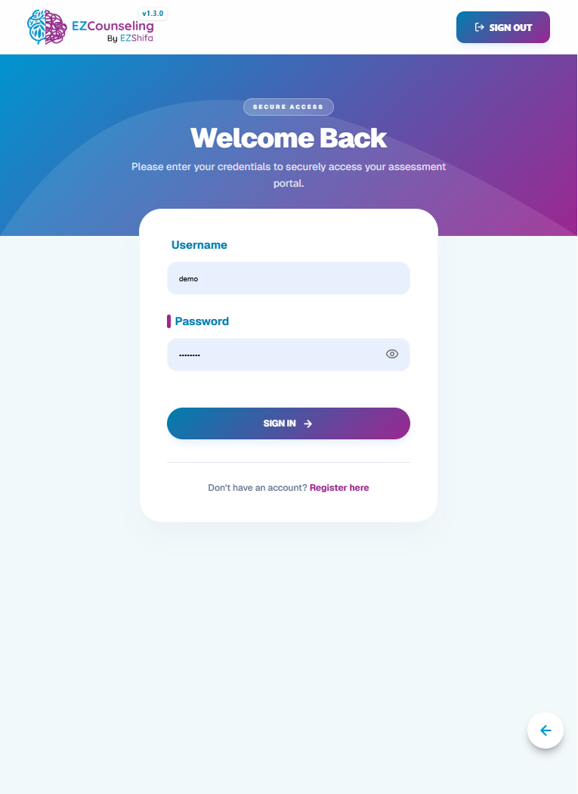

# 🧠 EZCounselling

  

EZCounselling is a mental health screening and assessment platform designed to help users understand their emotional wellbeing through structured questionnaires and guided evaluations.

It also supports research-based assessments for academic and clinical data collection, making it useful for both personal awareness and structured studies.

---

## 🌟 What This App Does

EZCounselling helps users:

- Check their daily emotional and mental wellbeing  
- Complete guided psychological assessments  
- Receive instant results and interpretations  
- Participate in structured research studies (when applicable)  
- Track mental health insights over time  

The platform is designed to make mental health evaluation simple, accessible, and structured.

---

## 🔄 How It Works (User Flow)

---

### 1. Sign In / Sign Up

  

Users start by creating an account or logging in to access the system.

---

### 2. Choose Mode

  

Users select one of two paths:

- **Daily Check-in** → General mental wellbeing tracking  
- **Research Center** *(restricted access)* → Specialized psychological studies  

---

### 3. Assessment Flow

  

Users answer structured questions step by step.

- Questions adapt based on assessment type  
- Designed to evaluate emotional patterns  
- Simple and guided experience  

---

### 4. Scoring System

  

After completion:

- Responses are analyzed automatically  
- A score is calculated using validated scales  
- Results are linked to the user entry  

---

### 5. Results Page

  

Users receive:

- Overall mental wellbeing score  
- Breakdown of responses  
- Simple interpretation of results  

---

## 📊 What the Platform Provides

### For Individuals
- Daily emotional self-checks  
- Awareness of mental wellbeing patterns  
- Clear feedback after each assessment  
- Simple guided experience  

---

### For Research / Clinical Use
- Structured data collection system  
- Separate handling of research responses  
- Consistent questionnaire format  
- Organized results for analysis  

---

## 🧠 Core Idea

EZCounselling bridges the gap between:

- Simple self-check mental health tools  
- Structured psychological research systems  

It allows both individuals and researchers to work with mental health data in a clean, structured, and meaningful way.

---

## 🎯 Key Benefits

- Easy to use for non-technical users  
- Clear guided assessment flow  
- Instant results after completion  
- Supports both personal and research use cases  
- Clean and structured data handling  

---

## 📌 Summary

EZCounselling is a guided mental health assessment platform that helps users understand their emotional wellbeing while also supporting structured psychological research in a clean, accessible, and scalable way.