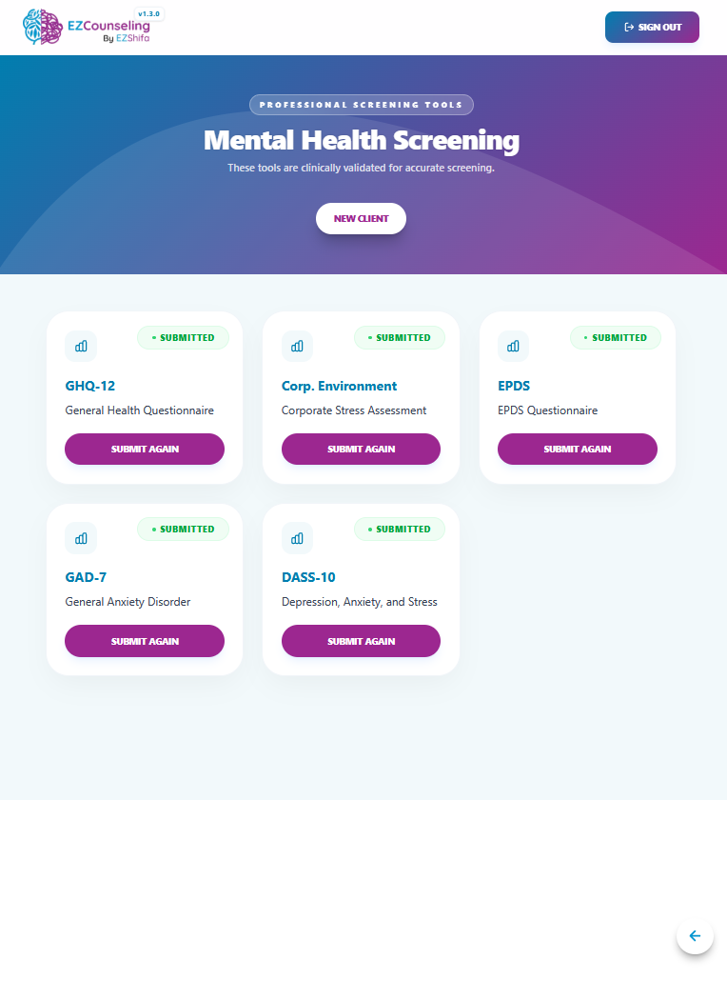
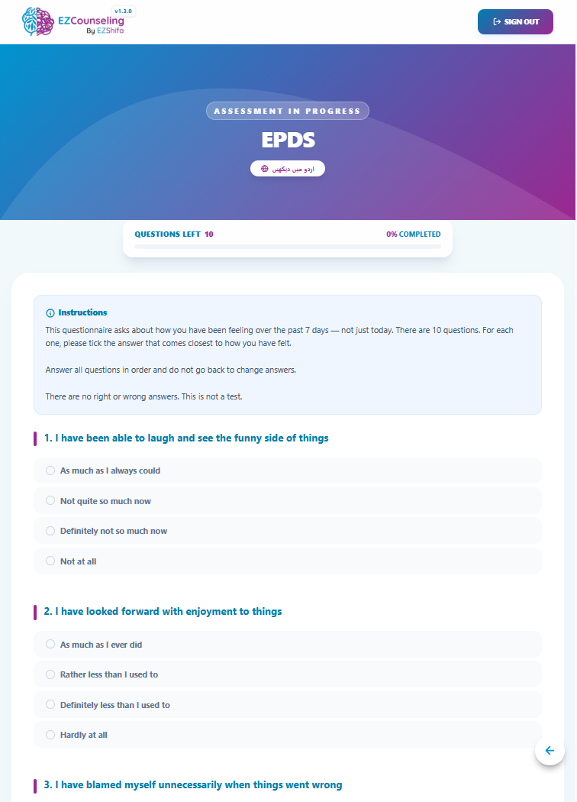
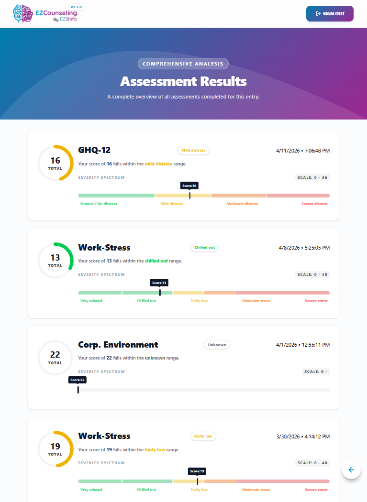

# 🧠 EZCounselling

  

EZCounselling is a mental health screening and assessment platform designed to help users understand their emotional wellbeing through structured questionnaires and guided evaluations.  
It also supports research-based assessments for academic and clinical data collection, making it useful for both personal awareness and structured studies.

---

## 🔄 How It Works

---

### 📊 Dashboard (Scale Overview)

  

After entering the system, users land on a dashboard that represents available assessments and their structure.

- Shows available mental health scales  
- Helps users understand what they are about to take  
- Acts as the starting point of the assessment journey  

---

### 📝 Assessment Flow

  

Users proceed through a structured set of psychological questions.

- Questions adapt based on selected scale  
- Designed to evaluate emotional and behavioral patterns  
- Simple, step-by-step guided experience  

---

### 📈 Results Page

  

After completion, users receive a clear breakdown of their results.

- Overall mental wellbeing score  
- Interpretation of responses  
- Insight into emotional patterns  

---

## 🧠 Core Idea

EZCounselling bridges the gap between:

- Simple self-check mental health tools  
- Structured psychological research systems  

It allows both individuals and researchers to work with mental health data in a clean, structured, and meaningful way.

---

## 🎯 Key Benefits

- Easy and intuitive for non-technical users  
- Step-by-step guided assessment flow  
- Instant results after completion  
- Supports both personal and research use cases  
- Clean and structured data handling  

---

## 📌 Summary

EZCounselling is a guided mental health assessment platform that helps users understand their emotional wellbeing while also supporting structured psychological research in a clean, accessible, and scalable way.